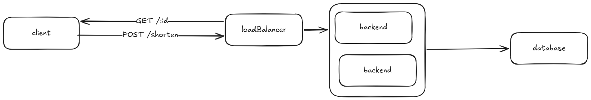
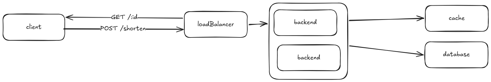
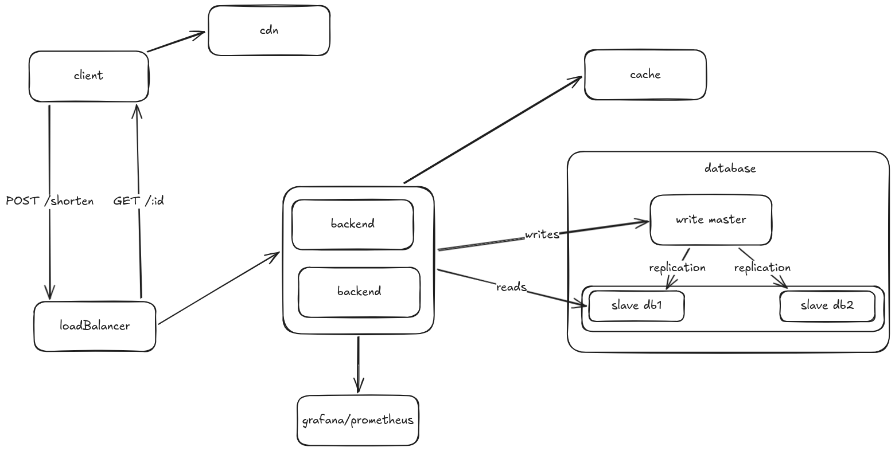

# Design - URL Shortener

## Functional Requirements

1. The system should be able to generate a short URL from a long URL.
2. The system should be able to redirect a short URL to the corresponding long URL.
3. The system should support URL expiration (configurable TTL).
4. The system should record basic analytics per URL (total clicks, date of last access

## Non-functional Requirements

- **Availability**: 99.99% uptime (≤ 52 min downtime/year).
- **Latency**: P99 < 50ms for redirection; P99 < 200ms for URL creation.
- **Scale**: support 100M URLs created per day and read volume 10x higher than write (1B redirections/day ≈ ~11,500 req/s).
- **Consistency**: eventual consistency is acceptable for analytics; strong consistency is required for short → long URL mapping.
- **Durability**: no URL should be lost after creation confirmation.

## Capacity Estimates

| Metrics             | Estimated Value  |
| ------------------- | ---------------- |
| Writes/day          | 100M             |
| Redirections/day    | 1B               |
| Read QPS            | ~1.160 req/s     |
| Write QPS           | ~11.600 req/s    |
| Average Record Size | ~500 bytes       |
| Storage (1 year)    | ~18 TB           |
| Read Bandwidth      | ~5.8 GB/s (pico) |

With cache, most redirections do not hit the database (popular URLs represent < 1% of total but account for > 80% of traffic — Pareto rule).

## Data Model

```sql
CREATE TABLE urls (
    id           BIGINT PRIMARY KEY,
    short_code   VARCHAR(8)  NOT NULL UNIQUE,
    long_url     TEXT        NOT NULL,
    created_at   TIMESTAMP   NOT NULL DEFAULT NOW(),
    expires_at   TIMESTAMP,               -- NULL = does not expire
    click_count  BIGINT      NOT NULL DEFAULT 0
);

CREATE INDEX idx_short_code ON urls (short_code);
```

## Endpoints

### Create Short URL

**Request**

```
POST /api/v1/shorten
Content-Type: application/json
```

```json
{
  "url": "https://www.example.com/some/long/url",
  "expires_in_days": 30 // optional; null = does not expire
}
```

**Response — Success**

```
HTTP 201 Created
```

```json
{
  "short_url": "https://short.url/abc123",
  "expires_at": "2026-03-26T20:00:00Z"
}
```

**Error Responses**
| Status | Reason |
|--------|-----------------------------------------|
| 400 | malformed or invalid URL |
| 429 | rate limit exceeded |

---

### Redirect Short URL

**Request**

```
GET /abc123
```

**Response — Success**

```
HTTP 301 Moved Permanently
Location: https://www.example.com/some/long/url
```

> **Why 301 and not 302?**
> The 301 (Moved Permanently) allows browsers and CDNs to cache the redirection, reducing latency and server load. The trade-off is that if the URL changes, the client's cache will not be automatically invalidated. For use cases where the URL needs to be editable or clicks need to be counted on every access, 302 (Found) is the correct choice as it forces the client to always consult the server. In this design, we will not update the long URL after creation, so 301 is appropriate.

**Error Response**
| Status | Reason |
|--------|-----------------------------------------|
| 404 | Short code not found |
| 410 | URL expired |

---


## Design Decisions

### 1. Short Code Generation

The recommended approach is **Sequential ID + Base62**:

1. A sequential ID generator (e.g., Twitter Snowflake or database auto-increment) produces a unique `BIGINT`.
2. This ID is encoded in Base62 with HashID (characters `0-9`, `a-z`, `A-Z`), resulting in a short string.

```
ID 1000000 → Base62 → "4c92"   (4 characters)
ID 3.5T    → Base62 → "zzzzzzz" (7 characters - max for 62^7)
```

With 7 characters in Base62, we have **62⁷ ≈ 3.5 trillion** unique URLs.

**Why not (MD5/SHA-256)?**
Hashes do not guarantee the absence of collisions in the truncated space. It would be necessary to check for collisions in the database at each creation, which adds latency and complexity. The sequential ID eliminates this problem by definition.

**Custom URLs** are stored directly as `short_code`, without encoding, after availability validation.

---

### 2. Storage

Two main options for the database layer are considered with their respective trade-offs:

| Option                          | Pros                                            | Cons                                      |
| ------------------------------- | ----------------------------------------------- | ----------------------------------------- |
| **PostgreSQL** (master/replica) | ACID, familiarity, efficient indexes            | Manual sharding is more complex           |
| **Cassandra**                   | Native sharding, high availability, write-heavy | No joins, eventual consistency by default |

**Recommendation**: PostgreSQL with read replication in the initial phases. Migrate to Cassandra (or similar) when the volume requires automatic horizontal sharding.

---

### 3. Redirection and Caching

The redirecting is the most frequent operation. The caching architecture is essential:

- **Layer 1 — CDN** (ex: Cloudflare): caches 301 redirects at the edge, close to the user. Latency < 10ms.
- **Layer 2 — Redis**: caches `short_code → long_url` mappings in the application. TTL aligned with the URL's `expires_at`.
- **Layer 3 — Database**: queried only on cache miss.

```
User → CDN → [HIT: redirect] / [MISS: Backend]
                                      ↓
                                    Redis → [HIT: redirect] / [MISS: DB]
```




---

### 4. Scalability

- **Load Balancer** in front of application servers (stateless, scale horizontally).
- **Read Replication** in the database: replicas handle all read traffic; master only for writes.
- **Sharding** by `short_code` (hash-based) when the volume exceeds the capacity of a single instance.

---

### 5. Security

- **Rate Limiting**: by IP and authenticated user if exists (e.g., 100 creations/hour for anonymous, 10,000/hour for authenticated).
- **Protection against malicious URLs**: optional integration with Google Safe Browsing API to block phishing/malware URLs.

---

### 6. Logging and Monitoring

- **Metrics** (ex: Prometheus + Grafana): creation and redirect QPS, cache hit/miss rate, P50/P95/P99 latency, error rate.
- **Structured Access Logs** (JSON) with `short_code`, `user_agent`, `ip` (anonymized), `timestamp`.
- **Alerts**: error rate > 1%, P99 latency > 200ms, cache hit rate < 80%.
- **Distributed Tracing** (ex: OpenTelemetry) to identify bottlenecks across layers.

## Conclusion

The design prioritizes **high availability and low read latency**, given that redirects outnumber creations by 10:1. Key decisions and their trade-offs are:

| Decision              | Choice                        | Trade-off Accepted                          |
| --------------------- | ----------------------------- | ------------------------------------------- |
| Code Generation       | Sequential ID + Base62        | IDs slightly predictable in sequence        |
| Initial Database      | PostgreSQL + replicas         | Manual sharding if needed in the future     |
| Redirect Cache        | CDN + Redis                   | Clicks not counted in CDN hits (301)        |
| Analytics Consistency | Eventual (asynchronous queue) | Click count may have slight delay           |
| Redirection           | HTTP 301                      | Clicks cached on the client are not tracked |


